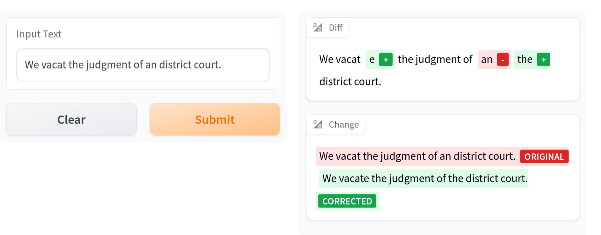

# LGEC: Legal Grammar Error Corrector

### Introduction
This project aims to implement a Grammarly like correction
algorithm, finetuned to work with legal text data.
See the trainer notebooks for the finetuning of the language model(s)
and corrector for the implementation of the grammar error corrector.

### Demo
We also built an interactive frontend, which is hosted on huggingface spaces [here](https://huggingface.co/spaces/isaacjeffersonlee/Legal-Grammar-Error-Corrector).
Note: It's a bit slow because we're using the free tier CPU instance (rather than a GPU).

### References
The main papers referenced were: 

1. ["The Unreasonable Effectiveness of Transformer Language Models in Grammar Error Correction" - Alikaniotis, Dimitrios and Raheja, Vipul, 2019](https://www.researchgate.net/publication/333640293_The_Unreasonable_Effectiveness_of_Transformer_Language_Models_in_Grammatical_Error_Correction)
2. ["Language Model Based Grammatical Error Correction without Annotated Training Data" - Bryant, Christopher and Briscoe, Ted 2018](https://aclanthology.org/W18-0529/)
3. ["Automatic Annotation and Evaluation of Error Types" - Bryant, Christopher; Felice, Mariano and Briscoe, Ted" 2017](https://aclanthology.org/P17-1074/) 
